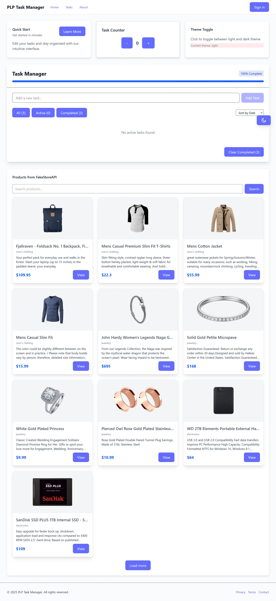

# PLP MERN Stack Classroom React Project

A modern React + Vite + Tailwind CSS front-end project for mastering component design, theming, and API integration. Features include:

- Custom Navbar, Footer, Card, Layout, and TaskManager components
- Theme context with global light/dark mode toggle (Tailwind dark mode)
- Responsive design and accessibility best practices
- API data fetching with search, pagination, and infinite scroll
- Custom animations and transitions for interactive elements



## Features

- **React 19** with functional components and hooks
- **Vite** for fast development and hot module replacement
- **Tailwind CSS** for utility-first styling and dark mode
- **PropTypes** for type safety
- **ThemeProvider** for global theme switching
- **TaskManager** with localStorage persistence
- **API Data** section using FakeStoreAPI
- **Responsive UI** and modern layouts

## Getting Started

### Prerequisites

- Node.js (v18 or newer recommended)
- npm (comes with Node.js)

### Installation

1.  Clone the repository:
    ```sh
    git clone <your-repo-url>
    cd plp-mern-stack-development-classroom-react-js-jsx-and-css-mastering-front-end-development-MERN-Stack/vite-project
    ```
2.  Install dependencies:
    ```sh
    npm install
    ```

### Running the Development Server

Start the app locally:

```sh
npm run dev
```

- The app will be available at [http://localhost:5173](http://localhost:5173) (or another port if 5173 is busy).

### Building for Production

```sh
npm run build
```

- Output will be in the `dist/` folder.

### Preview Production Build

```sh
npm run preview
```

## Project Structure

```
vite-project/
├── src/
│   ├── api/ApiData.jsx         # API data fetching component
│   ├── components/             # Reusable UI components
│   │   ├── Button.jsx
│   │   ├── Card.jsx
│   │   ├── Footer.jsx
│   │   ├── Layout.jsx
│   │   ├── Navbar.jsx
│   │   └── TaskManager.jsx
│   ├── contexts/ThemeContext.jsx # Theme context provider
│   ├── index.css               # Global styles (Tailwind + custom)
│   ├── App.jsx                 # Main app composition
│   └── main.jsx                # App entry point
├── tailwind.config.js          # Tailwind CSS config
├── postcss.config.js           # PostCSS config
├── package.json                # Project metadata and scripts
├── vite.config.js              # Vite config
└── README.md                   # Project documentation
```

## Theming

- Toggle light/dark mode using the floating button at the bottom-right.
- Theme is persisted in localStorage and uses Tailwind's `dark:` classes for global styling.

## API Data Section

- Fetches products from [FakeStoreAPI](https://fakestoreapi.com/)
- Features search, pagination, infinite scroll, and responsive Tailwind UI cards

## Custom Animations

- Buttons, cards, and theme toggle use smooth scale and fade transitions
- Easily extend with more Tailwind or custom keyframe animations

## Accessibility

- Keyboard navigation and ARIA attributes
- Skip-to-content link for screen readers

## Testing

- (Optional) Add tests in `src/__tests__/` using Jest and React Testing Library

## Troubleshooting

- If Tailwind styles do not apply, ensure `tailwind.config.js` and `postcss.config.js` exist and are correct
- If npm scripts fail on Windows PowerShell, set execution policy:
  ```powershell
  Set-ExecutionPolicy RemoteSigned -Scope CurrentUser
  ```
- For other issues, check the console output or open an issue

## License

MIT

## Credits

- [Tailwind CSS](https://tailwindcss.com/)
- [Vite](https://vitejs.dev/)
- [FakeStoreAPI](https://fakestoreapi.com/)
